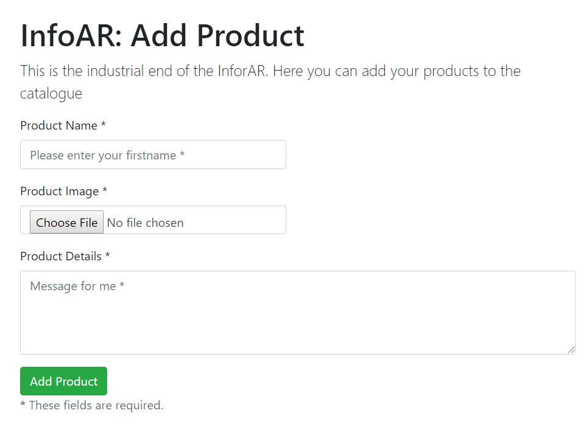

# InfoAR-AddProduct
This is the Add Product Interface of [InforAR](https://github.com/geekyJock8/InfoAR).
Use this to upload details of your product. 
 
Upload your product [here](http://geekyjock.me/InfoAR-AddProduct/

# How to Add Product
The following form contains 3 fields as of now.
1. **Product Name**: Enter the name of your product here.
1. **Product Image**: This is the image of your product. This is image probably going to be the packaging of the product.
                      This image is used by the [InforAR](https://github.com/geekyJock8/InfoAR) app to detect and track your product in
                      augmented reality. 
    Following are few suggestions to select your image:
    1. Format must be PNG or JPEG.
    1. Image's resolution should be at least 300 x 300 pixels.
    1. Avoid images with sparse features
    1. Avoid images with repetitive features.
     
    **Note**: *Right now there's no check being made in front end or back end to check if the file being uploaded is correct or not. So, if
               you upload a wrong file, it will get uploaded but you will not get the desired result.* The next step in this project is to
               add this check and also inform the user whether the quality of image is good or not.
1. **Product Detail**: This is where you add the relevent information of the product which you want to display. You add the different details
                       separated by comma. 
                       **Example**: Let's say that your product is Snickers and you want to show it's ingredients. The ingredients of Snicker
                       are chocolate, sugar, butter, milk, peanuts, corn, palm oil, salt, egg. So, you'll add all your products in this field
                       separted by commas:  
                       ***chocolate, sugar, butter, milk, peanuts, corn, palm oil, salt, egg*** 
                       **Note**: Right now it fetches the best results for each item from [Poly](https://poly.google.com/) and adds a rotation
                       animation to it.  
                       *You can upload your custom models to Poly with unique names and use those names in product detail field
                       to use your custom model*. Next iteration involves providing custom search features for Poly.

# Running the Project Locally

The [top](https://github.com/geekyJock8/InfoAR-AddProduct) directory contains the front-end of the website and 
[firebase-backend](https://github.com/geekyJock8/InfoAR-AddProduct/tree/master/firebase-backend) folder contains the backend logic.

**First clone the repo**

To run the **Front-end** app:
1. cd into the your repo
1. In terminal "npm install"
1. In terminal "npm start"
1. Your app will be served on "localhost:3000"
 
To run the <b>Back-end</b> app:
 
The back end is written using firebase functions. I've used firebase functions to act as an REST API. 
Here's a good <a href="https://blog.usejournal.com/build-a-serverless-full-stack-app-using-firebase-cloud-functions-81afe34a64fc">article</a>
to get you started with firebase based REST API.

1. So, first thing you need to do is generate a Security Key file from your firebase project. You can generate at: 
   your-firebase-project > Settings > Permissions > Service Account > Generate new private key
1. Download and save the generated file into firebase-backend/funtions/.
1. In *firebase-backend/functions/index.js* change projectid and keyfilename to your project id and your keyfilename.
**Note**: Since [InfoAR](https://github.com/geekyJock8/InfoAR) is connected to the API I created, your changes in your backend logic will
          not affect the main app and will only affect your firebase database.
1. cd into firebase-backend
1. In terminal "npm install -g firebase-tools"
1. In terminal "npm install"
1. Connect it to your firebase project
1. Make changes and deploy
   
